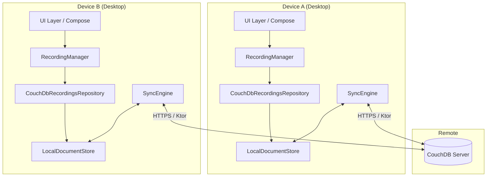
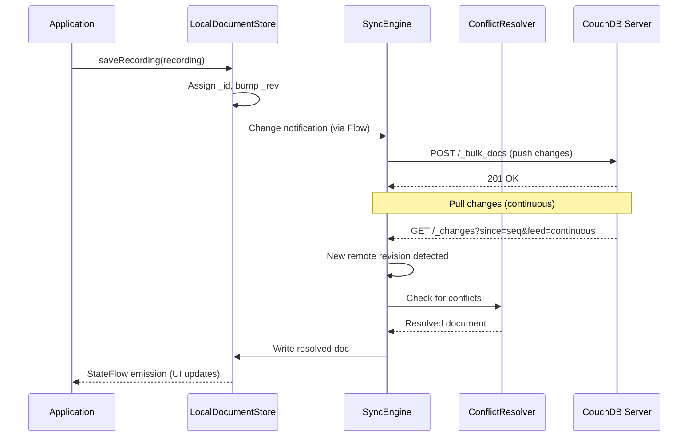

# Design Document: Multi-Device Recording Synchronization

## Overview

This design adds bidirectional synchronization of recordings, transcriptions, and summaries across multiple Jeeves installations using CouchDB's replication protocol. The architecture follows an offline-first approach: each device maintains a local CouchDB-compatible document store that replicates to a central CouchDB instance over HTTP.

The design leverages:
- **Ktor HTTP client** (already in use) to implement CouchDB's replication protocol
- **kotlinx.serialization** for CouchDB-compatible JSON document encoding
- **Kotlin coroutines** for non-blocking sync operations
- **Existing `RecordingsRepository` interface** for backwards-compatible local storage

Audio files (WAV, 50-200MB) are handled as CouchDB attachments with selective replication — metadata syncs immediately while audio downloads are deferred until explicitly requested.

### Design Decisions

| Decision | Rationale |
|----------|-----------|
| CouchDB replication over HTTP | Fits existing Ktor stack; no new transport dependencies |
| Local JSON document store (not embedded CouchDB) | Simpler than running a local CouchDB instance; sufficient for single-writer-per-device semantics |
| Selective replication for audio | Prevents bandwidth saturation; 200MB files shouldn't auto-download on metered connections |
| Last-write-wins for title/description | Simple conflict model for fields where merge is semantically unclear |
| Concatenation for notes | Preserves all user content; no data loss on concurrent edits |
| Union merge for tags/highlights | Order-independent collections; union is the natural merge |

## Architecture



### Replication Flow



### Module Placement

```
shared/
  src/commonMain/kotlin/com/jeeves/shared/
    sync/
      SyncEngine.kt              -- Replication orchestrator (interface + impl)
      CouchDbReplicator.kt       -- CouchDB HTTP protocol implementation
      ConflictResolver.kt        -- Conflict detection and resolution strategies
      LocalDocumentStore.kt      -- CouchDB-compatible local JSON store
      SyncConfiguration.kt       -- Config data class + validation
      SyncStatus.kt              -- Status sealed class + Flow
      DocumentSchema.kt          -- CouchDB document wrappers
      AudioAttachmentManager.kt  -- Selective audio file replication
    domain/
      Models.kt                  -- (existing, unchanged)
      Interfaces.kt              -- (existing, add SyncRepository interface)

desktopApp/
  src/desktopMain/kotlin/com/jeeves/desktop/
    data/
      CouchDbRecordingsRepository.kt  -- RecordingsRepository impl backed by LocalDocumentStore
      DataMigrator.kt                 -- SQLite → CouchDB document migration
    ui/screens/
      SettingsScreen.kt               -- (existing, add Sync configuration section)
    ui/components/
      SyncStatusIndicator.kt          -- Status badge composable
```

## Components and Interfaces

### SyncEngine

The central orchestrator managing bidirectional replication sessions.

```kotlin
interface SyncEngine {
    val status: StateFlow<SyncStatus>
    val pendingChanges: StateFlow<Int>
    val lastSyncTimestamp: StateFlow<Long?>

    suspend fun start(config: SyncConfiguration)
    suspend fun stop()
    suspend fun syncNow()
    suspend fun testConnection(config: SyncConfiguration): ConnectionTestResult
    fun getDeviceId(): String
}

sealed class SyncStatus {
    data object Idle : SyncStatus()
    data class Syncing(val direction: SyncDirection) : SyncStatus()
    data class Error(val message: String, val retryable: Boolean) : SyncStatus()
    data object Offline : SyncStatus()
}

enum class SyncDirection { PUSH, PULL, BOTH }

data class ConnectionTestResult(
    val success: Boolean,
    val errorType: ConnectionErrorType? = null,
    val message: String = ""
)

enum class ConnectionErrorType {
    INVALID_URL,
    NETWORK_UNREACHABLE,
    AUTHENTICATION_FAILED,
    TLS_ERROR,
    TIMEOUT
}
```

### CouchDbReplicator

Implements the CouchDB replication protocol using Ktor.

```kotlin
class CouchDbReplicator(
    private val httpClient: HttpClient,
    private val localStore: LocalDocumentStore,
    private val conflictResolver: ConflictResolver
) {
    /**
     * Push local changes to remote. Uses _bulk_docs endpoint.
     * Returns the number of documents successfully replicated.
     */
    suspend fun pushChanges(config: SyncConfiguration, since: String): ReplicationResult

    /**
     * Pull remote changes using _changes feed with long-polling.
     * Applies conflict resolution for documents with conflicting revisions.
     */
    suspend fun pullChanges(config: SyncConfiguration, since: String): ReplicationResult

    /**
     * Upload an audio attachment to a remote document.
     * Uses PUT /{db}/{docId}/{attachmentName} with Content-Type: audio/wav.
     */
    suspend fun pushAttachment(
        config: SyncConfiguration,
        docId: String,
        rev: String,
        attachmentName: String,
        audioBytes: ByteArray
    ): String // Returns new _rev

    /**
     * Download an audio attachment from remote.
     * Uses GET /{db}/{docId}/{attachmentName}.
     */
    suspend fun pullAttachment(
        config: SyncConfiguration,
        docId: String,
        attachmentName: String
    ): ByteArray
}

data class ReplicationResult(
    val documentsReplicated: Int,
    val documentsFailed: Int,
    val lastSequence: String,
    val errors: List<ReplicationError> = emptyList()
)

data class ReplicationError(
    val documentId: String,
    val reason: String,
    val retriesRemaining: Int
)
```

### LocalDocumentStore

A CouchDB-compatible local document store backed by JSON files in a directory structure.

```kotlin
class LocalDocumentStore(private val baseDir: File) {
    /**
     * Emits document IDs that have changed since last emission.
     * Used by SyncEngine to detect local writes needing push.
     */
    val changes: SharedFlow<DocumentChange>

    /** Read a document by _id. Returns null if not found. */
    suspend fun get(id: String): CouchDocument?

    /** Write a document. Validates _rev for optimistic concurrency. Emits to changes flow. */
    suspend fun put(doc: CouchDocument): CouchDocument

    /** Delete a document (tombstone). */
    suspend fun delete(id: String, rev: String): CouchDocument

    /** Bulk write for replication. Returns results per document. */
    suspend fun bulkDocs(docs: List<CouchDocument>, newEdits: Boolean = true): List<BulkDocResult>

    /** Get changes since a sequence number. */
    suspend fun changesSince(since: String, limit: Int = 100): ChangesResponse

    /** Get all documents matching a type prefix (e.g., "recording:"). */
    suspend fun allDocs(prefix: String): List<CouchDocument>

    /** Record migration completion marker. */
    suspend fun hasMigrationCompleted(): Boolean
    suspend fun markMigrationComplete()
}

data class DocumentChange(val id: String, val rev: String, val deleted: Boolean = false)

data class ChangesResponse(
    val results: List<DocumentChange>,
    val lastSeq: String
)
```

### ConflictResolver

Implements the conflict resolution strategies defined in the requirements.

```kotlin
class ConflictResolver(private val deviceId: String) {
    /**
     * Resolve conflicts between local and remote versions of a document.
     * Strategy depends on document type and field.
     */
    fun resolve(local: CouchDocument, remote: CouchDocument): ResolvedDocument

    /**
     * Resolve a Recording document conflict using field-specific strategies.
     */
    fun resolveRecording(local: RecordingDocument, remote: RecordingDocument): RecordingDocument

    /**
     * Resolve a TranscriptionResult or SummaryResult conflict.
     * Uses longest-content-wins strategy.
     */
    fun resolveTextDocument(local: CouchDocument, remote: CouchDocument): CouchDocument
}

data class ResolvedDocument(
    val winner: CouchDocument,
    val loser: CouchDocument?,
    val strategy: ResolutionStrategy,
    val auditEntry: ConflictAuditEntry
)

enum class ResolutionStrategy {
    LAST_WRITE_WINS,
    CONCATENATE,
    UNION_MERGE,
    LONGEST_CONTENT
}

data class ConflictAuditEntry(
    val documentId: String,
    val localDeviceId: String,
    val remoteDeviceId: String,
    val strategy: ResolutionStrategy,
    val resolvedAt: Long
)
```

### AudioAttachmentManager

Handles selective replication of large audio files.

```kotlin
class AudioAttachmentManager(
    private val replicator: CouchDbReplicator,
    private val localStore: LocalDocumentStore,
    private val audioDir: File
) {
    /**
     * Upload a local audio file as a CouchDB attachment.
     * Called after recording completes and initial metadata sync.
     */
    suspend fun uploadAudio(recordingId: String, localFilePath: String)

    /**
     * Download a remote audio attachment to local storage.
     * Returns the local file path where the audio was saved.
     */
    suspend fun downloadAudio(recordingId: String, config: SyncConfiguration): String

    /**
     * Check if a recording's audio is available locally.
     */
    fun isAudioAvailableLocally(recordingId: String): Boolean

    /**
     * Get the size of a remote audio attachment without downloading it.
     * Uses HEAD request on the attachment URL.
     */
    suspend fun getRemoteAudioSize(recordingId: String, config: SyncConfiguration): Long?
}

enum class AudioDownloadPolicy {
    ALWAYS,
    WIFI_ONLY,
    ON_DEMAND
}
```

### CouchDbRecordingsRepository

The new `RecordingsRepository` implementation that wraps the `LocalDocumentStore`.

```kotlin
class CouchDbRecordingsRepository(
    private val store: LocalDocumentStore,
    private val json: Json
) : RecordingsRepository {
    // Implements all RecordingsRepository methods by converting between
    // domain models (Recording, TranscriptionResult, SummaryResult) and
    // CouchDB documents with _id/_rev fields.
    
    // Document ID conventions:
    //   "recording:{id}"       -> Recording
    //   "transcription:{id}"   -> TranscriptionResult
    //   "summary:{id}"         -> SummaryResult
}
```

### SyncConfiguration

```kotlin
@Serializable
data class SyncConfiguration(
    val remoteUrl: String,         // CouchDB URL (e.g., "https://couch.example.com/jeeves")
    val username: String,
    val encryptedPassword: String, // Encrypted at rest, decrypted only for HTTP auth
    val enabled: Boolean = false,
    val audioDownloadPolicy: AudioDownloadPolicy = AudioDownloadPolicy.ON_DEMAND,
    val deviceId: String = ""      // UUID generated on first launch
)
```

## Data Models

### CouchDB Document Wrapper

All documents stored locally and replicated use this envelope:

```kotlin
@Serializable
data class CouchDocument(
    @SerialName("_id") val id: String,
    @SerialName("_rev") val rev: String? = null,
    @SerialName("_deleted") val deleted: Boolean = false,
    @SerialName("_attachments") val attachments: Map<String, AttachmentStub>? = null,
    val type: String,               // "recording", "transcription", "summary"
    val deviceId: String,           // Originating device
    val modifiedAt: Long,           // Millisecond timestamp for conflict resolution
    val body: kotlinx.serialization.json.JsonObject  // Type-specific payload
)

@Serializable
data class AttachmentStub(
    @SerialName("content_type") val contentType: String,
    val length: Long,
    val digest: String,
    val stub: Boolean = true  // true = not inline, must fetch separately
)
```

### Recording Document

```json
{
  "_id": "recording:abc123",
  "_rev": "3-a1b2c3d4",
  "type": "recording",
  "deviceId": "device-uuid-here",
  "modifiedAt": 1700000000000,
  "_attachments": {
    "audio.wav": {
      "content_type": "audio/wav",
      "length": 104857600,
      "digest": "md5-abc123...",
      "stub": true
    }
  },
  "body": {
    "id": "abc123",
    "filePath": "/Users/mark/Jeeves/audio/abc123.wav",
    "durationMs": 3600000,
    "createdAt": 1700000000000,
    "title": "Sprint Planning",
    "description": "Weekly sprint planning with team",
    "template": "GENERAL",
    "tags": ["sprint", "planning"],
    "folder": "",
    "highlights": [120000, 1800000],
    "attachments": [],
    "postRecordingNote": "Follow up on API redesign"
  }
}
```

### TranscriptionResult Document

```json
{
  "_id": "transcription:abc123",
  "_rev": "1-def456",
  "type": "transcription",
  "deviceId": "device-uuid-here",
  "modifiedAt": 1700000060000,
  "body": {
    "recordingId": "abc123",
    "text": "Welcome everyone to sprint planning...",
    "segments": [
      { "startMs": 0, "endMs": 5000, "text": "Welcome everyone", "speaker": "Speaker 1" }
    ],
    "language": "en",
    "durationMs": 3600000,
    "diarizationUnavailable": false
  }
}
```

### SummaryResult Document

```json
{
  "_id": "summary:abc123",
  "_rev": "1-789ghi",
  "type": "summary",
  "deviceId": "device-uuid-here",
  "modifiedAt": 1700000120000,
  "body": {
    "recordingId": "abc123",
    "summary": "The team discussed sprint goals...",
    "keyPoints": ["API redesign timeline agreed", "New hire onboarding plan"],
    "actionItems": ["Mark: Draft API spec by Friday"],
    "questions": ["Should we use GraphQL or REST?"],
    "tags": ["sprint", "planning", "api"],
    "modelUsed": "qwen3:8b",
    "recommendedQuestions": [],
    "qualityRating": null
  }
}
```

### Revision Generation

Revisions follow CouchDB's convention: `{generation}-{hash}` where:
- `generation` is an incrementing integer
- `hash` is an MD5 hex digest of the document content

```kotlin
fun generateRev(generation: Int, content: String): String {
    val hash = content.toByteArray().md5Hex()
    return "$generation-$hash"
}
```

### Conflict Audit Log Entry

```kotlin
@Serializable
data class ConflictAuditEntry(
    val id: String,                    // UUID
    val documentId: String,            // e.g., "recording:abc123"
    val localDeviceId: String,
    val remoteDeviceId: String,
    val strategy: ResolutionStrategy,
    val resolvedAt: Long,              // Epoch millis
    val localRev: String,
    val remoteRev: String,
    val winnerRev: String
)
```

## Correctness Properties

*A property is a characteristic or behavior that should hold true across all valid executions of a system — essentially, a formal statement about what the system should do. Properties serve as the bridge between human-readable specifications and machine-verifiable correctness guarantees.*

### Property 1: Document ID determinism

*For any* Recording, TranscriptionResult, or SummaryResult domain object, converting it to a CouchDB document and reading back the `_id` field SHALL always produce the same deterministic value derived from the document type and the recording identifier.

**Validates: Requirements 2.4**

### Property 2: Migration round-trip preservation

*For any* valid Recording, TranscriptionResult, or SummaryResult, migrating it from the SQLite representation to a CouchDB document and reading it back through the `RecordingsRepository` interface SHALL produce a value equal to the original for every field.

**Validates: Requirements 2.5**

### Property 3: Revision uniqueness on write

*For any* document in the LocalDocumentStore, each call to `put()` SHALL produce a `_rev` value that is distinct from all previous `_rev` values for that document.

**Validates: Requirements 2.6**

### Property 4: Last-write-wins correctness for title/description

*For any* two conflicting Recording documents with distinct `modifiedAt` timestamps, the ConflictResolver SHALL select the title and description from the document with the greater `modifiedAt` value; and if timestamps are identical, SHALL select from the document whose `deviceId` is lexicographically greater.

**Validates: Requirements 5.2**

### Property 5: Note concatenation preserves all content

*For any* two conflicting Recording documents with non-empty `postRecordingNote` fields, the resolved note SHALL contain the full text of both conflicting notes, ordered by `modifiedAt` ascending, with each prefixed by the originating `deviceId`.

**Validates: Requirements 5.3**

### Property 6: Tags/highlights union merge

*For any* two conflicting Recording documents, the resolved `tags` list SHALL equal the set union of both tag lists (case-sensitive), and the resolved `highlights` list SHALL equal the set union of both highlight lists.

**Validates: Requirements 5.4**

### Property 7: Longest-content-wins for text documents

*For any* two conflicting TranscriptionResult or SummaryResult documents, the ConflictResolver SHALL select the version with the longer text content (character count) as primary; and if lengths are equal, SHALL select the version with the more recent `modifiedAt` timestamp.

**Validates: Requirements 5.5**

### Property 8: Schema validation rejects malformed documents

*For any* JSON object that is missing a required field or contains a field of incorrect type relative to the Recording, TranscriptionResult, or SummaryResult schemas, the LocalDocumentStore SHALL reject it during replication write and not persist it locally.

**Validates: Requirements 7.5**

### Property 9: Serialization round-trip

*For any* valid Recording, TranscriptionResult, or SummaryResult domain object, serializing to a CouchDB document JSON and deserializing back SHALL produce an equivalent domain object.

**Validates: Requirements 2.1, 2.2**

## Error Handling

### Network Errors

| Scenario | Behaviour |
|----------|-----------|
| Connection timeout (>10s on test) | Report `ConnectionErrorType.TIMEOUT` |
| DNS resolution failure | Report `ConnectionErrorType.NETWORK_UNREACHABLE` |
| TLS certificate invalid | Refuse connection, report `ConnectionErrorType.TLS_ERROR` |
| HTTP 401/403 | Report `ConnectionErrorType.AUTHENTICATION_FAILED`, stop auto-retry |
| HTTP 5xx on document push | Retry 3× with exponential backoff (5s, 10s, 20s) |
| Mid-transfer failure (audio) | Retry 3× with exponential backoff, then report failure |

### Data Errors

| Scenario | Behaviour |
|----------|-----------|
| Schema validation failure on pull | Discard document, log `_id` and reason, continue replication |
| Conflict detected | Route to ConflictResolver, log audit entry |
| Migration failure for single document | Skip, log error with document ID and reason, continue migration |
| Partial write prevention | Use atomic file rename (write to `.tmp`, rename on success) |

### Offline Behaviour

- All local writes succeed immediately regardless of network state
- Changes are queued persistently in the LocalDocumentStore's change sequence
- On reconnect, SyncEngine replays all changes since last successful sync
- Queue survives application restart (persisted as part of the document store)

## Testing Strategy

### Unit Tests (Example-Based)

- Settings validation: empty fields, malformed URLs, valid configurations
- Connection test result mapping: HTTP status codes → `ConnectionErrorType`
- Sync status transitions: idle → syncing → idle, idle → error → idle
- Audio download policy enforcement: verify deferred downloads when policy is ON_DEMAND
- Audit log entry creation and 90-day retention check
- Device ID generation and persistence across restarts

### Property-Based Tests (Kotest Property)

Each correctness property above maps to a property-based test using `io.kotest:kotest-property` (already in test dependencies).

Configuration:
- Minimum 100 iterations per property
- Custom generators for Recording, TranscriptionResult, SummaryResult, and CouchDocument
- Tag format: `Feature: multi-device-sync, Property {N}: {title}`

Properties to implement:
1. Document ID determinism (Property 1)
2. Migration round-trip preservation (Property 2)
3. Revision uniqueness on write (Property 3)
4. Last-write-wins correctness (Property 4)
5. Note concatenation completeness (Property 5)
6. Tags/highlights union merge (Property 6)
7. Longest-content-wins (Property 7)
8. Schema validation rejection (Property 8)
9. Serialization round-trip (Property 9)

### Integration Tests

- Full push/pull cycle against a local CouchDB Docker container
- Audio attachment upload/download round-trip
- Conflict resolution end-to-end (two writes, pull, verify resolution)
- Migration from SQLite with real data files
- Network interruption recovery (simulate disconnect during sync)

### Test Infrastructure

- Use `ktor-client-mock` (already in test dependencies) for unit-level HTTP tests
- Use Testcontainers with CouchDB image for integration tests
- Custom Kotest generators for domain models (leverage existing `@Serializable` for arbitrary JSON generation)
