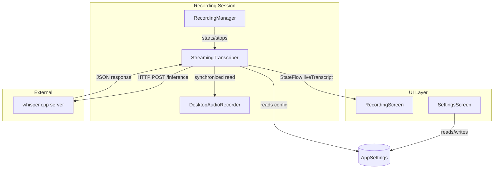
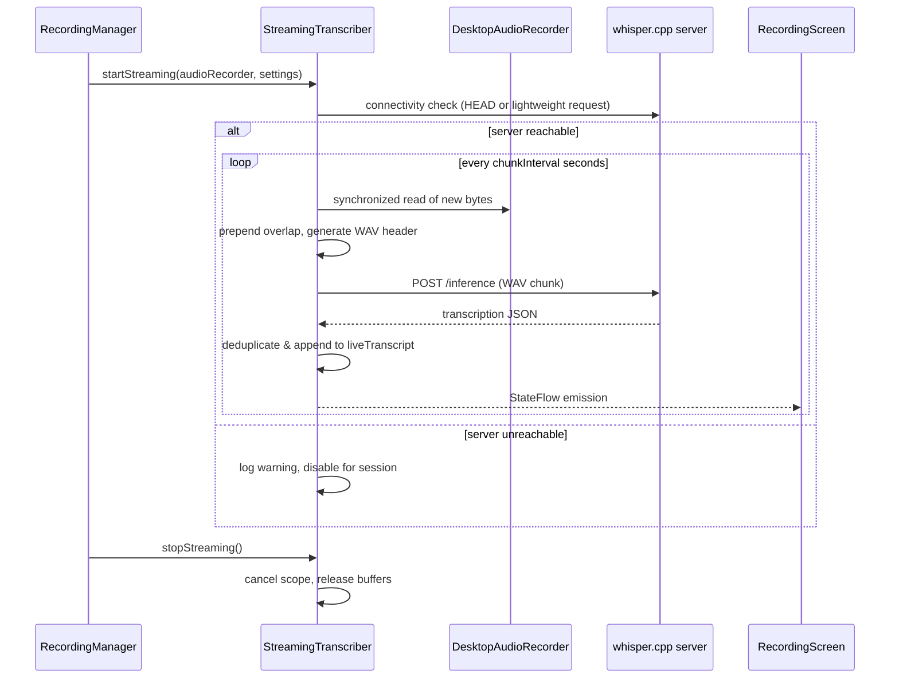

# Design Document: Real-Time Streaming Transcription

## Overview

This feature adds live transcription feedback during recording sessions in Jeeves Desktop. A new `StreamingTranscriber` component periodically extracts audio chunks from the `DesktopAudioRecorder`'s in-memory buffer, wraps them in WAV format, and POSTs them to the local whisper.cpp server's `/inference` endpoint. Returned text is assembled into a running live transcript using suffix-prefix deduplication to handle overlap between chunks. The live transcript is displayed on the `RecordingScreen` in a scrollable container while recording is active.

The existing post-recording full-file transcription pipeline remains completely unchanged — it continues to produce the authoritative saved transcription. The streaming transcript is purely a real-time preview that is discarded once the final result arrives.

### Key Design Decisions

1. **Desktop-only component**: `StreamingTranscriber` lives in `desktopApp` because it directly accesses `DesktopAudioRecorder`'s `audioBuffer`. No shared/common abstraction is needed since iOS uses a different audio stack.
2. **Coroutine-scoped lifecycle**: The transcriber creates a child `CoroutineScope` tied to each recording session. When the session ends, structured concurrency cancels all in-flight work automatically.
3. **HTTP POST per chunk (not WebSocket)**: whisper.cpp server accepts complete audio files. Each chunk is a self-contained WAV with proper headers.
4. **Overlap window for continuity**: To prevent words being cut mid-utterance at chunk boundaries, a configurable tail of the previous chunk is prepended to the current one.
5. **Suffix-prefix deduplication**: Because overlap causes the server to re-transcribe boundary words, we detect repeated text between consecutive responses and remove duplicates.

## Architecture



### Component Interaction Sequence



## Components and Interfaces

### StreamingTranscriber

**Location**: `desktopApp/src/desktopMain/kotlin/com/jeeves/desktop/audio/StreamingTranscriber.kt`

```kotlin
class StreamingTranscriber(
    private val httpClient: HttpClient
) {
    /** Live transcript text, observed by RecordingScreen */
    val liveTranscript: StateFlow<String>

    /** Whether a chunk request is currently in flight */
    val isTranscribing: StateFlow<Boolean>

    /**
     * Begin streaming transcription for a recording session.
     * Performs connectivity check, then launches periodic chunk extraction.
     * Returns immediately; work happens in a child coroutine scope.
     */
    fun startStreaming(
        audioRecorder: DesktopAudioRecorder,
        settings: AppSettings,
        parentScope: CoroutineScope
    )

    /**
     * Stop streaming and release all resources.
     * Cancels in-flight requests and clears overlap buffer.
     */
    fun stopStreaming()
}
```

### Internal Methods (private)

| Method | Responsibility |
|--------|---------------|
| `checkServerConnectivity(baseUrl: String): Boolean` | HEAD request with 3s timeout. Returns false on failure. |
| `extractChunk(audioRecorder: DesktopAudioRecorder, channels: Int): ByteArray` | Synchronized read of new bytes since last extraction. |
| `buildWavPayload(pcmData: ByteArray, sampleRate: Int, channels: Int, bitsPerSample: Int): ByteArray` | Prepends 44-byte WAV header to raw PCM. |
| `applyOverlap(currentChunk: ByteArray, previousTail: ByteArray): ByteArray` | Concatenates overlap tail + current chunk. |
| `sendChunkForTranscription(wavData: ByteArray, config: AiEndpointConfig): String?` | POST to /inference, parse text from verbose_json response. |
| `deduplicateAndAppend(existing: String, newText: String): String` | Suffix-prefix match (≥3 words), append non-overlapping portion. |

### AppSettings Extensions

New fields added to the existing `AppSettings` data class in `shared/.../domain/Models.kt`:

```kotlin
@Serializable
data class AppSettings(
    // ... existing fields ...
    val streamingEnabled: Boolean = true,
    val chunkIntervalSeconds: Int = 5,
    val overlapWindowSeconds: Float = 2.0f
)
```

### RecordingManager Integration

`RecordingManager` gains a reference to `StreamingTranscriber` (constructor-injected). It calls:
- `streamingTranscriber.startStreaming(...)` immediately after `audioRecorder.startRecording(...)` succeeds
- `streamingTranscriber.stopStreaming()` at the beginning of `stopRecording()`, before writing the final WAV file

The `StreamingTranscriber` is a passive collaborator — `RecordingManager` owns the lifecycle decisions.

### RecordingScreen UI Additions

- A `LazyColumn` or `SelectionContainer` with `verticalScroll` constrained to `maxHeight = 200.dp`
- Auto-scroll via `LaunchedEffect` on transcript changes (respecting manual scroll position)
- Pulsing ellipsis indicator when `isTranscribing` is true
- Placeholder text ("Listening for speech...") when transcript is empty during recording
- Section hidden entirely when `streamingEnabled = false`

### SettingsScreen Additions

New "Streaming Transcription" card containing:
- Toggle switch for `streamingEnabled`
- Slider or number field for `chunkIntervalSeconds` (3–30)
- Slider or number field for `overlapWindowSeconds` (0.5–5.0, step 0.1)
- Validation: overlap < chunkInterval; error text shown inline when violated
- Save button disabled when validation fails

## Data Models

### WAV Header Structure (44 bytes)

| Offset | Size | Field | Value |
|--------|------|-------|-------|
| 0 | 4 | ChunkID | "RIFF" |
| 4 | 4 | ChunkSize | 36 + dataSize |
| 8 | 4 | Format | "WAVE" |
| 12 | 4 | Subchunk1ID | "fmt " |
| 16 | 4 | Subchunk1Size | 16 |
| 20 | 2 | AudioFormat | 1 (PCM) |
| 22 | 2 | NumChannels | 1 or 2 |
| 24 | 4 | SampleRate | 16000 |
| 28 | 4 | ByteRate | sampleRate × channels × bitsPerSample/8 |
| 32 | 2 | BlockAlign | channels × bitsPerSample/8 |
| 34 | 2 | BitsPerSample | 16 |
| 36 | 4 | Subchunk2ID | "data" |
| 40 | 4 | Subchunk2Size | dataSize |
| 44 | ... | Data | PCM bytes |

### Chunk Extraction Model

```kotlin
/** Tracks streaming state within a session */
internal class StreamingSession(
    val sampleRate: Int = 16000,
    val channels: Int,           // 1 or 2, from session format
    val bitsPerSample: Int = 16,
    val chunkIntervalSeconds: Int,
    val overlapWindowSeconds: Float
) {
    /** Byte offset into audioBuffer marking where the last extraction ended */
    var lastReadPosition: Int = 0

    /** Tail bytes from the previous chunk, used for overlap prepend */
    var previousChunkTail: ByteArray = ByteArray(0)

    /** Computed overlap size in bytes */
    val overlapBytes: Int
        get() = (overlapWindowSeconds * sampleRate * channels * (bitsPerSample / 8)).toInt()
}
```

### Suffix-Prefix Deduplication

The deduplication algorithm operates on word tokens:

1. Split existing transcript tail into last N words (N = configurable max, default 20)
2. Split new chunk text into words
3. Find longest suffix of existing words that matches a prefix of new words (minimum match = 3 words)
4. If match found: append only the portion of new text after the matched prefix
5. If no match: append entire new text separated by a space

```
Existing:  "...the meeting will start at three"
New chunk:  "will start at three o'clock in the afternoon"
Match:      "will start at three" (4 words)
Result:     "...the meeting will start at three o'clock in the afternoon"
```

### Streaming Configuration Validation Rules

| Field | Type | Default | Range | Constraint |
|-------|------|---------|-------|------------|
| streamingEnabled | Boolean | true | — | — |
| chunkIntervalSeconds | Int | 5 | 3–30 | — |
| overlapWindowSeconds | Float | 2.0 | 0.5–5.0 | Must be < chunkIntervalSeconds |

## Correctness Properties

*A property is a characteristic or behavior that should hold true across all valid executions of a system — essentially, a formal statement about what the system should do. Properties serve as the bridge between human-readable specifications and machine-verifiable correctness guarantees.*

### Property 1: WAV Header Correctness

*For any* valid PCM byte array of arbitrary length and any channel count (1 or 2), `buildWavPayload` SHALL produce a byte array where:
- The first 4 bytes are "RIFF"
- Bytes 8–11 are "WAVE"
- The ChunkSize field (bytes 4–7, little-endian uint32) equals the total output length minus 8
- The NumChannels field (bytes 22–23) matches the input channel count
- The SampleRate field (bytes 24–27) equals 16000
- The Subchunk2Size field (bytes 40–43) equals the input PCM byte array length
- The total output length equals the input PCM length + 44

**Validates: Requirements 1.2**

### Property 2: Overlap Prepend Concatenation

*For any* previous chunk tail byte array and any current chunk byte array, `applyOverlap(currentChunk, previousTail)` SHALL produce a byte array that:
- Has length equal to `previousTail.size + currentChunk.size`
- Starts with exactly the bytes of `previousTail`
- Ends with exactly the bytes of `currentChunk`

Additionally, *for any* previous chunk shorter than the configured overlap window size, the function SHALL use all available bytes from the previous chunk (no padding or truncation).

**Validates: Requirements 1.3**

### Property 3: Suffix-Prefix Deduplication

*For any* two word sequences A and B where the last K words of A equal the first K words of B (with K ≥ 3), `deduplicateAndAppend(A, B)` SHALL produce a result that:
- Contains all words of A in order
- Contains all words of B that come after the matched prefix, in order
- Does not contain any duplicated word sequence at the junction
- Has total word count equal to `|A| + |B| - K`

*For any* two word sequences A and B with no suffix-prefix match of 3 or more words, `deduplicateAndAppend(A, B)` SHALL produce a result equal to `A + " " + B` (simple concatenation with space separator).

**Validates: Requirements 3.1, 3.2**

### Property 4: Whitespace-Only Text Rejection

*For any* string composed entirely of whitespace characters (spaces, tabs, newlines) or the empty string, and *for any* existing live transcript value, attempting to append the whitespace string SHALL leave the live transcript unchanged (idempotent — the transcript before equals the transcript after).

**Validates: Requirements 3.6**

### Property 5: Settings Range Validation

*For any* integer value for `chunkIntervalSeconds`:
- If the value is in [3, 30], the validation function SHALL return valid
- If the value is outside [3, 30], the validation function SHALL return invalid

*For any* float value for `overlapWindowSeconds`:
- If the value is in [0.5, 5.0], the validation function SHALL return valid
- If the value is outside [0.5, 5.0], the validation function SHALL return invalid

**Validates: Requirements 6.2, 6.3**

### Property 6: Overlap Must Be Less Than Interval

*For any* pair of values `(overlapWindowSeconds, chunkIntervalSeconds)`, the cross-field validation function SHALL return valid if and only if `overlapWindowSeconds < chunkIntervalSeconds`. All pairs where `overlapWindowSeconds >= chunkIntervalSeconds` SHALL be rejected.

**Validates: Requirements 6.7**

## Error Handling

| Scenario | Behaviour | User Impact |
|----------|-----------|-------------|
| Whisper server unreachable at session start | Log warning, disable streaming for this session | Recording proceeds normally; no live transcript shown |
| Chunk request returns HTTP 4xx/5xx | Log error, skip chunk, continue with next interval | Brief gap in live transcript; recovers on next chunk |
| Chunk request times out (>30s) | Cancel request, skip chunk, continue | Same as above |
| Audio buffer shorter than expected overlap | Use all available bytes as overlap | Slightly less overlap; minor risk of word truncation at that boundary |
| Whisper server returns empty/whitespace text | Discard response silently | No visible change to live transcript |
| Exception during WAV header generation | Log error, skip chunk | Gap in transcript; should not happen with valid PCM data |
| Recording stops while chunk in flight | Cancel via structured concurrency (scope cancellation) | Clean shutdown; no orphaned requests |
| Settings have overlap ≥ interval | Settings screen prevents saving; validation error shown | User must correct before saving |

### Graceful Degradation

The streaming transcription is entirely optional and non-blocking. If any part of the streaming pipeline fails:
1. The recording itself is never interrupted
2. The final full-file transcription is unaffected
3. The UI simply shows less (or no) live transcript text

## Testing Strategy

### Property-Based Tests (Kotest Property)

The project already has `io.kotest:kotest-property:5.8.0` in `commonTest` dependencies.

Each property test runs a minimum of 100 iterations with randomly generated inputs.

| Test | Property | Library | Tag |
|------|----------|---------|-----|
| WAV header fields are correct for any PCM data | Property 1 | kotest-property | Feature: realtime-streaming-transcription, Property 1: WAV header correctness |
| Overlap prepend is exact concatenation | Property 2 | kotest-property | Feature: realtime-streaming-transcription, Property 2: Overlap prepend concatenation |
| Deduplication removes exactly the overlapping words | Property 3 | kotest-property | Feature: realtime-streaming-transcription, Property 3: Suffix-prefix deduplication |
| Whitespace input leaves transcript unchanged | Property 4 | kotest-property | Feature: realtime-streaming-transcription, Property 4: Whitespace-only text rejection |
| Range validation accepts/rejects correctly | Property 5 | kotest-property | Feature: realtime-streaming-transcription, Property 5: Settings range validation |
| Cross-field validation enforces overlap < interval | Property 6 | kotest-property | Feature: realtime-streaming-transcription, Property 6: Overlap less than interval |

### Unit Tests (Example-Based)

| Test | Validates |
|------|-----------|
| Parse verbose_json response extracts text correctly | Req 2.2 |
| HTTP error does not throw, returns null | Req 2.3 |
| Timeout returns null after 30s | Req 2.5 |
| Live transcript retains value after stopStreaming | Req 3.4 |
| Live transcript resets to empty on startStreaming | Req 3.5 |
| streamingEnabled=false prevents chunk extraction | Req 6.4 |
| Server unreachable disables streaming for session | Req 7.4 |
| stopStreaming clears previousChunkTail | Req 7.2 |

### Integration Tests

| Test | Validates |
|------|-----------|
| Full chunk extraction + transcription cycle with mock server | Reqs 1.1, 2.1, 2.4 |
| Pause suspends extraction, resume restarts timer | Reqs 1.4, 1.5 |
| Structured concurrency: scope cancel stops all work | Req 7.3 |
| Sequential processing: second chunk waits for first | Req 2.4 |
| Full recording pipeline (stop → final transcription) unchanged | Req 5.1, 5.2 |

### Test Configuration

- Property tests: minimum 100 iterations per property
- Kotest property tests use `checkAll` with custom `Arb` generators
- Custom generators needed for:
  - `Arb.pcmByteArray()` — random byte arrays with even length (16-bit samples)
  - `Arb.wordSequence()` — random sequences of alphabetic words
  - `Arb.overlappingWordPair()` — two word sequences with a controlled overlap region
  - `Arb.whitespaceString()` — strings composed only of whitespace characters

