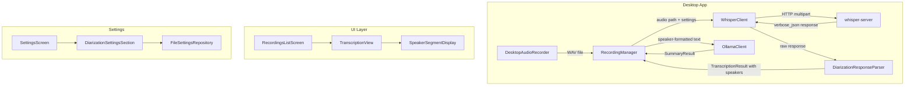

# Design Document: Speaker Diarization

## Overview

This design adds speaker diarization support to Jeeves, enabling transcription segments to be attributed to individual speakers. The implementation leverages whisper.cpp server's built-in diarization capabilities (`--diarize` for stereo channel-based identification and `--tinydiarize` for model-based speaker turn detection).

### Key Research Findings

Based on analysis of the [whisper.cpp server source code](https://github.com/ggerganov/whisper.cpp/blob/master/examples/server/server.cpp):

1. **`--diarize` (stereo mode)**: Requires 2-channel stereo audio. The server compares energy levels between channels to assign speaker labels "0", "1", or "?" per segment. In `verbose_json` response format, each segment includes a `"speaker"` field.
2. **`--tinydiarize` (model-based)**: Uses a special tdrz-trained model. Inserts `[SPEAKER_TURN]` markers in text output to indicate speaker changes. In verbose_json, turn boundaries are available but speaker IDs are not directly provided—the client must infer speaker identity from turn boundaries.
3. **Server-level configuration**: Both `--diarize` and `--tinydiarize` are server startup flags, not per-request parameters. The whisper-server must be launched with the appropriate flag. The client cannot toggle diarization per-request via form fields.

### Design Decision: Server Configuration vs Per-Request

Since diarization is a server startup flag, the design must account for this constraint:
- The app assumes the whisper-server is already configured with `--diarize` or `--tinydiarize` at launch time.
- The app's "diarization enabled" setting controls whether the client **parses** speaker information from the response, not whether it requests diarization.
- When `--diarize` is active on the server, the `verbose_json` response includes `"speaker"` fields. The client simply reads them.
- When `--tinydiarize` is active, the client must parse `[SPEAKER_TURN]` markers from segment text to infer speaker boundaries.

The app settings tell the client which parsing strategy to use based on how the user has configured their whisper-server.

## Architecture



### Data Flow

1. **Recording**: `DesktopAudioRecorder` captures audio in mono or stereo (based on settings)
2. **Transcription Request**: `WhisperClient` sends audio to whisper-server with `response_format=verbose_json`
3. **Response Parsing**: `DiarizationResponseParser` extracts speaker labels from the JSON response:
   - In `diarize` mode: reads the `"speaker"` field directly from each segment
   - In `tinydiarize` mode: parses `[SPEAKER_TURN]` markers from segment text and assigns incremental speaker labels
4. **Summarization**: `RecordingManager` formats speaker-attributed text before sending to Ollama
5. **Display**: UI renders segments with speaker colours and grouping

## Components and Interfaces

### 1. DiarizationResponseParser (New - shared module)

Responsible for extracting speaker information from whisper-server responses.

```kotlin
package com.jeeves.shared.ai

/**
 * Parses speaker diarization data from whisper-server responses.
 * Supports both --diarize (structured speaker field) and --tinydiarize (text markers) modes.
 */
class DiarizationResponseParser {

    /**
     * Parse verbose_json response, extracting speaker labels based on configured mode.
     */
    fun parseSegments(
        segments: List<WhisperSegment>,
        mode: DiarizationMode
    ): List<TranscriptionSegment> {
        return when (mode) {
            DiarizationMode.DIARIZE -> parseDiarizeMode(segments)
            DiarizationMode.TINYDIARIZE -> parseTinyDiarizeMode(segments)
        }
    }

    /**
     * In diarize mode, the server provides a "speaker" field ("0", "1", "?") per segment.
     * Map these to "Speaker 0", "Speaker 1", or null for "?".
     */
    private fun parseDiarizeMode(segments: List<WhisperSegment>): List<TranscriptionSegment>

    /**
     * In tinydiarize mode, segments may contain [SPEAKER_TURN] markers in text.
     * Track speaker turns and assign incremental labels ("Speaker 0", "Speaker 1", ...).
     */
    private fun parseTinyDiarizeMode(segments: List<WhisperSegment>): List<TranscriptionSegment>
}
```

### 2. WhisperClient Changes

The `WhisperClient` is updated to:
- Always request `verbose_json` format (already done)
- Deserialize the optional `speaker` field from segments
- Delegate to `DiarizationResponseParser` when diarization is enabled in settings

```kotlin
// Updated WhisperSegment to include optional speaker field
@Serializable
data class WhisperSegment(
    val start: Double,
    val end: Double,
    val text: String,
    val speaker: String? = null  // Present when server runs with --diarize
)
```

### 3. AppSettings Extensions

```kotlin
@Serializable
data class AppSettings(
    // ... existing fields ...
    val diarizationEnabled: Boolean = false,
    val diarizationMode: DiarizationMode = DiarizationMode.TINYDIARIZE,
    val stereoRecording: Boolean = false
)

@Serializable
enum class DiarizationMode {
    DIARIZE,      // Stereo channel-based (requires 2-channel audio and --diarize server flag)
    TINYDIARIZE   // Model-based turn detection (requires --tinydiarize server flag and tdrz model)
}
```

### 4. TranscriptionResult Extensions

```kotlin
@Serializable
data class TranscriptionResult(
    val recordingId: String,
    val text: String,
    val segments: List<TranscriptionSegment> = emptyList(),
    val language: String = "en",
    val durationMs: Long = 0,
    val diarizationUnavailable: Boolean = false  // True when diarization was requested but failed
)
```

### 5. DesktopAudioRecorder Changes

Add stereo recording support:

```kotlin
class DesktopAudioRecorder : AudioRecorder {
    // Channel count determined at recording start based on settings
    private var channels: Int = 1

    fun startRecording(outputPath: String, stereo: Boolean) {
        channels = if (stereo) 2 else 1
        val audioFormat = AudioFormat(
            16000f,  // 16kHz sample rate
            16,      // 16-bit
            channels,
            true,    // signed
            false    // little-endian
        )
        // ... validate line supports requested channel count, fallback to mono if not
    }
}
```

### 6. OllamaClient Changes

Updated summarization prompt when speaker data is available:

```kotlin
private fun buildSummarizationPrompt(transcription: TranscriptionResult): String {
    val hasSpeakers = transcription.segments.any { it.speaker != null }

    val formattedText = if (hasSpeakers) {
        formatWithSpeakers(transcription.segments)
    } else {
        transcription.text
    }

    val speakerInstruction = if (hasSpeakers) {
        "The transcription includes speaker labels. When summarising, attribute key points and action items to the speaker who raised them where possible."
    } else ""

    // ... build prompt with speaker context
}

private fun formatWithSpeakers(segments: List<TranscriptionSegment>): String {
    return segments.joinToString("\n") { segment ->
        if (segment.speaker != null) {
            "${segment.speaker}: ${segment.text}"
        } else {
            segment.text
        }
    }
}
```

### 7. Speaker Display UI Component

```kotlin
@Composable
fun SpeakerSegmentDisplay(
    segments: List<TranscriptionSegment>
) {
    val speakerColors = remember(segments) {
        buildSpeakerColorMap(segments)
    }

    // Group consecutive segments by speaker
    val groupedSegments = remember(segments) {
        groupBySpeaker(segments)
    }

    LazyColumn {
        items(groupedSegments) { group ->
            SpeakerGroup(
                speaker = group.speaker,
                segments = group.segments,
                color = speakerColors[group.speaker]
            )
        }
    }
}

private val SPEAKER_PALETTE = listOf(
    Color(0xFFE3F2FD), // Blue 50
    Color(0xFFFCE4EC), // Pink 50
    Color(0xFFF3E5F5), // Purple 50
    Color(0xFFE8F5E9), // Green 50
    Color(0xFFFFF3E0), // Orange 50
    Color(0xFFE0F7FA), // Cyan 50
)

private fun buildSpeakerColorMap(segments: List<TranscriptionSegment>): Map<String, Color> {
    val speakers = segments.mapNotNull { it.speaker }.distinct()
    return speakers.mapIndexed { index, speaker ->
        speaker to SPEAKER_PALETTE[index % SPEAKER_PALETTE.size]
    }.toMap()
}
```

## Data Models

### Updated Domain Models

```kotlin
// TranscriptionSegment already has speaker field - no schema change needed
@Serializable
data class TranscriptionSegment(
    val startMs: Long,
    val endMs: Long,
    val text: String,
    val speaker: String? = null  // Already exists, will now be populated
)

// New: Diarization mode enum
@Serializable
enum class DiarizationMode {
    DIARIZE,
    TINYDIARIZE
}

// Extended AppSettings
@Serializable
data class AppSettings(
    val transcriptionEndpoint: AiEndpointConfig = /* ... */,
    val summarizationEndpoint: AiEndpointConfig = /* ... */,
    val recordingHotkey: String = "Ctrl+Shift+R",
    val audioFormat: String = "wav",
    val sampleRate: Int = 16000,
    val diarizationEnabled: Boolean = false,
    val diarizationMode: DiarizationMode = DiarizationMode.TINYDIARIZE,
    val stereoRecording: Boolean = false
)
```

### WhisperSegment (API Response Model)

```kotlin
@Serializable
data class WhisperSegment(
    val start: Double,
    val end: Double,
    val text: String,
    val speaker: String? = null  // New field - present in --diarize verbose_json responses
)
```

### Speaker Group (UI Model)

```kotlin
data class SpeakerGroup(
    val speaker: String?,        // null means no speaker label
    val segments: List<TranscriptionSegment>
)
```

### Serialization Compatibility

The `FileSettingsRepository` already uses `ignoreUnknownKeys = true`, so existing settings files without the new diarization fields will deserialize safely using defaults. New fields use `false`/`TINYDIARIZE` defaults ensuring backward compatibility.


## Correctness Properties

*A property is a characteristic or behavior that should hold true across all valid executions of a system—essentially, a formal statement about what the system should do. Properties serve as the bridge between human-readable specifications and machine-verifiable correctness guarantees.*

### Property 1: Speaker Field Mapping Preserves Valid Labels and Normalizes Invalid Ones

*For any* whisper server response segment, the `DiarizationResponseParser` in diarize mode SHALL:
- preserve the exact speaker string value when it is a non-empty string (e.g., "0", "1")
- produce a null speaker field when the input speaker value is null, empty string, missing, or any non-string/invalid value

**Validates: Requirements 1.4, 2.1, 2.2, 7.4**

### Property 2: TranscriptionResult Serialization Round-Trip

*For any* valid `TranscriptionResult` object (including segments with speaker labels, null speakers, and the `diarizationUnavailable` flag), serializing to JSON and deserializing back SHALL produce an object with identical field values for `recordingId`, `text`, `language`, `durationMs`, `diarizationUnavailable`, and all segment fields (`startMs`, `endMs`, `text`, `speaker`).

**Validates: Requirements 2.3**

### Property 3: Speaker Turn Marker Extraction

*For any* list of whisper segments where segment text contains `[SPEAKER_TURN]` markers, the `DiarizationResponseParser` in tinydiarize mode SHALL:
- remove all `[SPEAKER_TURN]` marker strings from the output segment text
- assign incrementing speaker labels ("Speaker 0", "Speaker 1", ...) where each marker occurrence increments the speaker counter
- ensure no output segment text contains the literal string `[SPEAKER_TURN]`

**Validates: Requirements 2.4**

### Property 4: Consecutive Same-Speaker Grouping

*For any* list of `TranscriptionSegment` objects, the `groupBySpeaker` function SHALL produce groups where:
- no two adjacent groups share the same speaker label value (string equality)
- the concatenation of all segments across all groups equals the original input list in order
- each group's speaker field matches the speaker field of all segments within that group

**Validates: Requirements 3.2**

### Property 5: Speaker Color Assignment by First-Appearance Order

*For any* list of `TranscriptionSegment` objects with speaker labels, the `buildSpeakerColorMap` function SHALL assign palette indices such that:
- the first unique speaker encountered gets index 0
- the second unique speaker encountered gets index 1
- the Nth unique speaker gets index (N-1) mod palette_size
- the same speaker always maps to the same color within a single transcription

**Validates: Requirements 3.4, 3.5**

### Property 6: Speaker-Attributed Text Formatting

*For any* list of `TranscriptionSegment` objects where at least one segment has a non-null speaker field, the summarization text formatter SHALL:
- prepend `"{speaker}: "` to the text of every segment that has a non-null speaker field
- include the text of segments with null speaker fields without any prefix
- preserve the original order of segments in the output

**Validates: Requirements 5.1, 5.3**

## Error Handling

### Diarization Unavailable Fallback

The primary error handling strategy is graceful degradation—if diarization data is unavailable for any reason, the app falls back to plain transcription without speaker attribution.

**Scenarios:**

| Scenario | Behaviour | User Impact |
|----------|-----------|-------------|
| Server not started with `--diarize`/`--tinydiarize` | No speaker fields in response; parser produces null speakers | Transcription displays without speaker labels |
| Server returns error related to diarization | `WhisperClient` retries without the `diarize` form param; sets `diarizationUnavailable = true` | User sees transcription without speakers; info banner indicates diarization was unavailable |
| Response has malformed speaker data | Parser normalizes to null; logs warning with segment index | Affected segments show without speaker label |
| Stereo device unavailable | Recorder falls back to mono; exposes error message | User sees warning that stereo wasn't available; recording proceeds in mono |
| tinydiarize model not loaded | No `[SPEAKER_TURN]` markers in output | Parser produces all-null speakers; behaves like no diarization |

### Retry Strategy

```
1. Send request with diarize=true (if enabled in settings)
2. If HTTP 4xx with diarization-related error body:
   a. Log warning: "Diarization unavailable on server"
   b. Retry request without diarize param (within 5 seconds)
   c. Set diarizationUnavailable = true on result
3. If HTTP 400 "unrecognized parameter":
   a. Log warning: "Server does not support diarize parameter"
   b. Retry without the parameter
   c. Set diarizationUnavailable = true
4. If retry succeeds: return transcription with null speakers
5. If retry also fails: propagate the error normally
```

### Logging

All fallback scenarios produce structured log warnings via `AppLogger.warn()` including:
- The original error response
- Which segment (by index) had malformed data
- That diarization was disabled for this transcription

## Testing Strategy

### Property-Based Testing

This feature contains pure data transformation logic (parsing, formatting, grouping, colour mapping) that is well-suited to property-based testing. The feature will use **Kotest's property-based testing** module (`io.kotest.property`) for Kotlin.

**Configuration:**
- Minimum 100 iterations per property test
- Each property test references its design document property
- Tag format: `Feature: speaker-diarization, Property {number}: {title}`

**Properties to implement:**
1. Speaker field mapping (generators: random speaker strings, nulls, empty strings, numbers-as-strings)
2. TranscriptionResult serialization round-trip (generators: random TranscriptionResult with varying segments)
3. Speaker turn marker extraction (generators: random text with `[SPEAKER_TURN]` markers at random positions)
4. Consecutive same-speaker grouping (generators: random segment lists with repeating/varying speaker patterns)
5. Speaker colour assignment (generators: random segment lists with 1-20 unique speakers)
6. Speaker-attributed text formatting (generators: random segment lists with mixed null/non-null speakers)

### Unit Tests (Example-Based)

- Whisper client includes `diarize=true` field when setting is enabled (Req 1.1)
- Whisper client omits `diarize` field when setting is disabled (Req 1.2)
- Default settings have `diarizationEnabled = false` (Req 4.1)
- Default settings have `stereoRecording = false` (Req 6.4)
- Default diarization mode is `TINYDIARIZE` (Req 4.4)
- Audio format uses 2 channels when stereo enabled (Req 6.1)
- Audio format uses 1 channel when stereo disabled (Req 6.2)
- Summarization prompt includes attribution instruction when speakers present (Req 5.4)
- Summarization prompt omits attribution instruction when no speakers (Req 5.2)
- `diarizationUnavailable` flag set on fallback (Req 7.5)
- Channel config doesn't change mid-recording (Req 6.6)
- Null speaker segments render without label (Req 3.3)

### Integration Tests

- Settings round-trip through `FileSettingsRepository` (Req 4.2, 4.5, 6.3)
- Retry flow with mock HTTP server returning 4xx (Req 7.1, 7.2, 7.3)
- Stereo fallback with mocked `AudioSystem` (Req 6.5)

### Edge Cases (Covered by Property Generators)

- Segments with speaker "?" from diarize mode (treated as valid speaker label)
- More speakers than palette colours (cycling verified in Property 5)
- Empty segment lists
- All segments with same speaker (single group)
- Alternating speakers every segment
- `[SPEAKER_TURN]` at start/end/middle of text
- Multiple consecutive `[SPEAKER_TURN]` markers
- Unicode text mixed with markers
